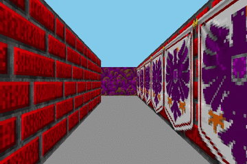

# Cub3D

このプロジェクトではレイキャスティングを使用して３D画像を描写するプログラムを作成しました。  
42東京のtsekiguc, tkaneshiによる共同開発です。



## 概要

コマンドライン引数からマップ情報を含んだファイル名を受け取り、3Dを描写します。  
キー入力のイベントを受け取って、3Dのマップ内を移動することが出来ます。

## 開発及び実行環境

Xubuntu 18.04

## 使い方

任意のディレクトリで以下のコマンドを実行してください。

```bash
git clone https://github.com/TaiyouSekiguchi/cub3D.git
make
./cub3D ./map/standard.cub
```

## 操作方法

| Key | Action     |
| --- | ---------- |
| ESC | ゲーム終了 |
| A   | 左へ移動   |
| D   | 右へ移動   |
| W   | 前進       |
| S   | 後退       |
| ←   | 左へ回転   |
| →   | 右へ回転   |

## マップファイル

マップファイルには以下の情報が含まれています。

### 壁の画像ファイルのパス

識別子の後に画像ファイルのパスを入力

| 識別子 | 内容     |
| ------ | -------- |
| NO     | 北側の壁 |
| SO     | 南側の壁 |
| WE     | 西側の壁 |
| EA     | 東側の壁 |

### 床、天井の色

識別子の後にRGBの値を入力（カンマ区切り）

| 識別子 | 内容     |
| ------ | -------- |
| F      | 床の色   |
| C      | 天井の色 |

### マップ情報

画像ファイルパス、床・天井の色情報のあと空行を入ると、それ以降がマップ情報として認識されます。

| 識別子 | 内容                               |
| ------ | ---------------------------------- |
| 0      | 移動できる空間                     |
| 1      | 壁                                 |
| N      | プレイヤーのスポーン位置（北向き） |
| E      | プレイヤーのスポーン位置（東向き） |
| S      | プレイヤーのスポーン位置（南向き） |
| W      | プレイヤーのスポーン位置（西向き） |
